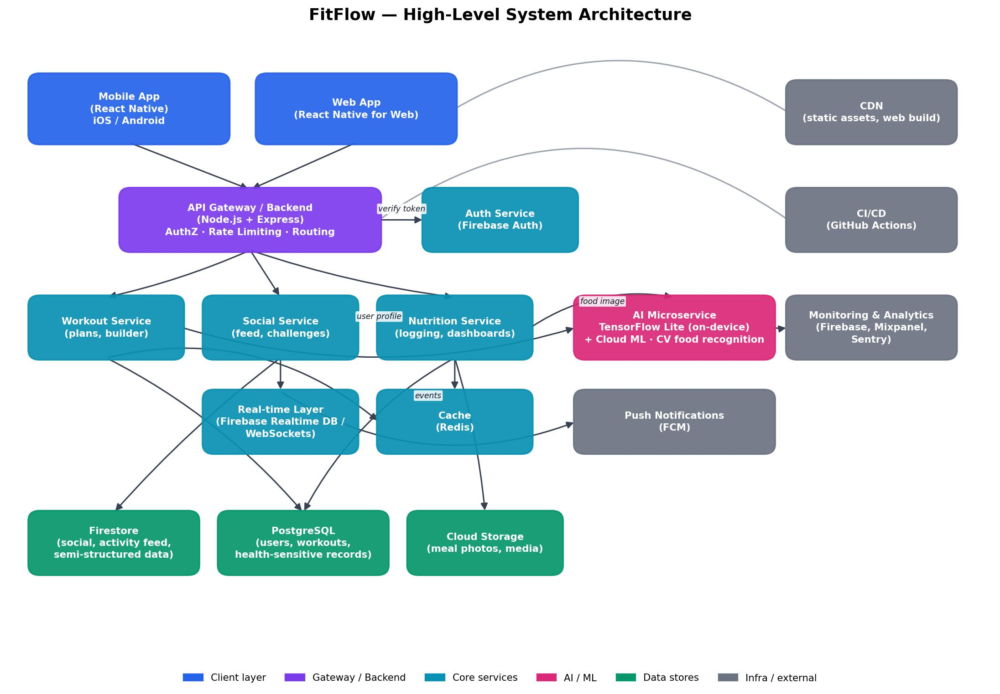

# FitFlow Redesign

IT3060 – Human Computer Interaction | Lab Exercise 05
SLIIT, Year 3, Semester 2, 2026
Campus: Malabe Campus | Name: MADAMPE NTS | IT No:   IT23607514

## Overview

FitFlow is a fitness-tracking app redesign addressing three core pain points identified during
user research: a personalization gap in workout plans, social isolation during solo workouts,
and tedious manual nutrition logging (68% onboarding drop-off). This repository contains the
initial project scaffold for the technology stack and architecture selected in Lab Exercise 05.

## Tech Stack

| Layer          | Choice                                                              |
|----------------|----------------------------------------------------------------------|
| Frontend       | React Native (+ React Native Web) — 4.45/5 in the decision matrix   |
| API Gateway    | Node.js / Express — AuthZ, rate limiting, routing                   |
| Core Services  | Workout Service · Social Service · Nutrition Service (Node.js)      |
| AI Microservice| Python — TensorFlow Lite (on-device) + Cloud ML (CV food recognition)|
| Databases      | Firestore/Realtime DB (social, real-time) + PostgreSQL (core, health-sensitive) |
| Cache          | Redis                                                                |
| Auth           | Firebase Auth, hardened with Firestore security rules + field-level encryption |
| CI/CD          | GitHub Actions                                                      |

Full comparison tables and scoring: [docs/comparison-matrix.md](docs/comparison-matrix.md)
Technology rationale: [docs/tech-stack-summary.md](docs/tech-stack-summary.md)
Architecture decision record: [docs/adr-001-tech-stack-architecture.md](docs/adr-001-tech-stack-architecture.md)

## Architecture



- **Client layer**: React Native mobile app (iOS/Android) + React Native for Web
- **API Gateway**: Node.js + Express — authentication checks, rate limiting, routing
- **Core services**: Workout Service, Social Service, Nutrition Service
- **AI Microservice**: TensorFlow Lite (on-device) + cloud ML for heavier models and computer-vision food recognition, isolated for independent scaling
- **Real-time layer**: Firebase Realtime Database / WebSockets → Firebase Cloud Messaging
- **Caching**: Redis
- **Data layer**: Firestore (social/activity data) + PostgreSQL (users, workouts, health-sensitive records) + Cloud Storage (meal photos/media)
- **Supporting infra**: GitHub Actions (CI/CD), Firebase/Mixpanel/Sentry (monitoring), CDN (static web assets)

See [docs/architecture-notes.md](docs/architecture-notes.md) for full data-flow walkthroughs
(personalized workout plans, social sharing, nutrition tracking) and the security/scalability
considerations.

## Project Structure

```
fitflow-redesign/
├── frontend/                     # React Native app (+ React Native Web)
│   └── src/
├── backend/
│   ├── api-gateway/               # Node.js/Express — AuthZ, rate limiting, routing
│   └── services/
│       ├── workout-service/       # AI-generated plans, drag-and-drop builder
│       ├── social-service/        # Feed, challenges, private circles
│       └── nutrition-service/     # Camera-based logging, dashboards
├── ai-service/                    # Python — TensorFlow Lite + cloud ML, CV food recognition
│   ├── app/
│   └── models/
├── docs/                          # Comparison tables, decision matrix, ADR, architecture diagram
├── .github/workflows/             # CI/CD pipelines (per-service)
├── .gitignore
└── README.md
```

## Getting Started

### Frontend
```bash
cd frontend
npm install
npm start
```

### API Gateway
```bash
cd backend/api-gateway
npm install
npm run dev
```

### Core services
Each service under `backend/services/<service-name>/` is set up the same way:
```bash
cd backend/services/workout-service
npm install
npm run dev
```

### AI Microservice
```bash
cd ai-service
pip install -r requirements.txt
uvicorn app.main:app --reload
```

## CI/CD

Each of `frontend`, `backend/api-gateway`, `backend/services/*`, and `ai-service` has its own
GitHub Actions workflow under `.github/workflows/`, matching the independent-scaling and
independent-deployment approach described in ADR-001.

## Branching

- `main` — protected, requires PR review before merging
- Feature branches: `feature/<short-description>`
- Fix branches: `fix/<short-description>`

## Repository

https://github.com/nadija-xz/fitflow-Redesing.git

